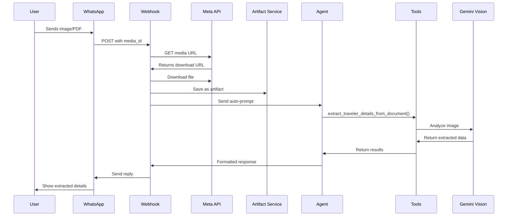

# WhatsApp Media Handling Guide

## Overview
The WhatsApp integration now **automatically downloads and processes** images and documents sent by users. No manual prompting needed!

## How It Works

### 1. **Automatic Media Download**
When a user sends an image or document via WhatsApp:
- The webhook receives the message from Meta's Cloud API
- It automatically downloads the media file using the Media ID
- Saves it as an artifact in the user's session
- Auto-generates an appropriate prompt for the AI agent

### 2. **Smart Auto-Prompts**
Based on the file type, different prompts are generated:

| File Type | Auto-Generated Prompt |
|-----------|----------------------|
| **Images** (JPG, PNG, WebP) | "I uploaded {filename}. Please extract traveler details from this document." |
| **PDFs** | "I uploaded {filename}. Please analyze this insurance document." |
| **Other documents** | "I uploaded {filename}. Please review this document." |

### 3. **User Can Override with Caption**
If the user sends the media with a caption, that caption becomes the prompt instead:
```
User sends: [Passport Image] + Caption: "Check this passport"
→ AI receives: "Check this passport"
```

### 4. **AI Processing**
The AI agent then:
- Receives the auto-generated (or custom) prompt
- Has access to the uploaded file as an artifact
- Calls appropriate tools:
  - `extract_traveler_details_from_document()` for passports/IDs
  - `analyze_insurance_document()` for policy PDFs
- Returns extracted information or analysis

## User Experience Examples

### Example 1: Passport Upload (No Caption)
```
👤 User: [Sends passport image]
🤖 Buddy: Let me extract the details from your passport...

Full Name: John Smith
Date of Birth: 15 March 1985
Passport Number: AB1234567
Nationality: Indian
Valid Until: 12 Jan 2030

Is this correct? I can now use these details for your booking.
```

### Example 2: Policy PDF with Caption
```
👤 User: [Sends PDF] + "Compare this with quotes"
🤖 Buddy: I've analyzed your current policy. Here's how it compares...

Your Current Policy (from PDF):
- Provider: ICICI Lombard
- Coverage: $50,000
- Premium: ₹2,800

New Quote Options:
1. Tata AIG Travel Guard - ₹2,450 (12% savings)
...
```

### Example 3: Multiple Documents
```
👤 User: [Sends Passport 1]
🤖 Buddy: Got Traveler 1's details:
         Name: Sarah Johnson, DOB: 22 May 1990

👤 User: [Sends Passport 2]
🤖 Buddy: Got Traveler 2's details:
         Name: Mike Johnson, DOB: 18 Aug 1988
         
         Perfect! All traveler details collected. Ready to book?
```

## Technical Flow



## Configuration Required

### 1. Environment Variables (.env)
```bash
# WhatsApp Cloud API credentials
WHATSAPP_PHONE_NUMBER_ID=your_phone_number_id
WHATSAPP_TOKEN=your_permanent_access_token
WHATSAPP_VERIFY_TOKEN=your_webhook_verify_token

# Public URL for PDF downloads (must be accessible by Meta's servers)
PUBLIC_BASE_URL=https://your-server.com

# Gemini API for document analysis
GEMINI_API_KEY=your_gemini_api_key
```

### 2. Meta Webhooks Configuration
In your Meta App Dashboard:
1. Enable **messages** and **messaging_postbacks** webhook fields
2. Make sure the webhook includes the `messages` object with media fields

### 3. Media Permissions
Ensure your WhatsApp Business Account has permissions to:
- Receive media messages
- Access the Media API

## Supported Media Types

| Type | Formats | Max Size | Auto-Processing |
|------|---------|----------|-----------------|
| **Images** | JPEG, PNG, WebP | 5 MB | ✅ Auto extracts traveler details |
| **Documents** | PDF | 100 MB | ✅ Auto analyzes policy docs |
| **Audio** | MP3, OGG, AMR | 16 MB | ❌ Not supported yet |
| **Video** | MP4, 3GP | 16 MB | ❌ Not supported yet |

## Error Handling

### Common Issues and Solutions

**1. "Document received but couldn't be downloaded"**
- **Cause**: Invalid WHATSAPP_TOKEN or expired media URL
- **Solution**: Check token validity, media URLs expire after ~1 hour

**2. "Document received without media ID"**
- **Cause**: Meta webhook didn't include media_id
- **Solution**: Check webhook configuration includes media fields

**3. PDF not sent in response**
- **Cause**: PUBLIC_BASE_URL not set or inaccessible
- **Solution**: Ensure PUBLIC_BASE_URL is publicly accessible by Meta's servers

**4. "Document received but processing failed"**
- **Cause**: Artifact service error or network issue
- **Solution**: Check logs, ensure disk space available

## Best Practices

### For Users:
1. **Send clear images**: Ensure passport/ID is well-lit and readable
2. **Use captions for context**: Add "for traveler 2" or "compare with current policy"
3. **One document at a time**: Wait for confirmation before sending next document

### For Agents/Admins:
1. **Monitor logs**: Check `[whatsapp]` log entries for media download status
2. **Test regularly**: Send test documents to verify auto-processing works
3. **Check quota**: Meta API has rate limits on media downloads
4. **Backup strategy**: If auto-processing fails, user can still describe document contents

## Debugging

### Enable Verbose Logging
```python
# In hip/whatsapp/webhook.py
logger.setLevel(logging.DEBUG)
```

### Check Media Download
```bash
# Tail logs to see media processing
tail -f your_app.log | grep "\[whatsapp\]"
```

### Verify Artifacts Saved
```bash
# Check artifacts directory
ls -lah hip/.adk/artifacts/apps/my_agent/users/*/sessions/*/
```

### Test Manually
Use the WhatsApp API tester in Meta Business Suite to send test images/PDFs.

## Future Enhancements

Planned improvements:
- [ ] Multi-page PDF processing (extract from specific pages)
- [ ] Audio message transcription for voice notes
- [ ] Video thumbnail extraction
- [ ] Batch document upload (multiple passports at once)
- [ ] Document type auto-detection (passport vs Aadhaar vs PAN)
- [ ] OCR fallback for poor quality images

## FAQ

**Q: Can users send multiple documents in one message?**
A: No, WhatsApp sends each document as a separate message. Each is processed individually.

**Q: What if the user's document is rejected by AI?**
A: The agent will explain what's unclear and ask for a better image or manual entry.

**Q: Are uploaded documents stored permanently?**
A: Yes, as artifacts in the user's session. They persist until session cleanup.

**Q: Can I disable auto-prompting?**
A: Yes, if a caption is provided, it overrides the auto-prompt. Or modify `_process_message()` logic.

**Q: How much does media download cost?**
A: Meta doesn't charge for media downloads, but you pay for outbound messages.

---

**Updated**: December 2024
**Version**: 2.0 (Auto-download enabled)
