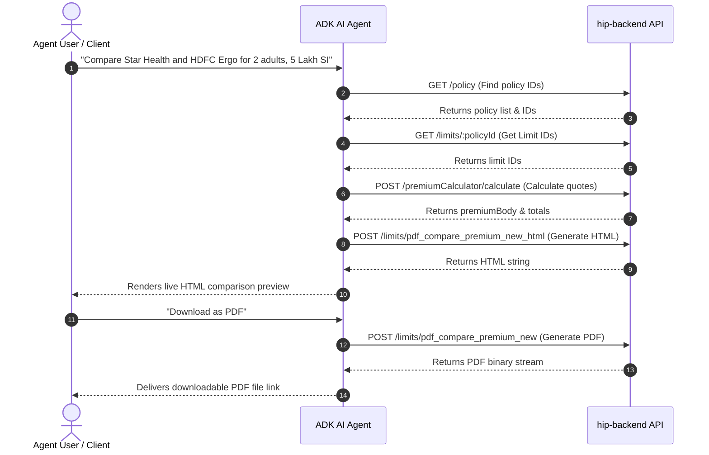

# Health Insurance Agent API Integration Guide (Google ADK)

Guide for connecting Google ADK (Agent Development Kit) AI Agent with `hip-backend` APIs for Policy Search, Premium Calculation, Live HTML Preview, and PDF Generation.

---

## 1. Security & Authentication Architecture

> [!IMPORTANT]
> Never expose JWT tokens or backend credentials in client-side LLM context. Pass authentication tokens strictly via environment variables or secure server-side session headers.

### Environment Configuration (`.env`)
```env
BACKEND_BASE_URL=http://localhost:5000
AGENT_JWT_TOKEN=eyJhbGciOiJIUzI1NiIsInR5cCI6IkpXVCJ9...
```

### Security Checklist
1. **Token Transport**: Send JWT token in `Cookie: Authorization=<AGENT_JWT_TOKEN>` header for protected endpoints.
2. **Server-Side Tool Execution**: Define ADK tools on backend/mid-tier proxy. Agent LLM calls tools via schema; proxy appends JWT before hitting `hip-backend`.
3. **Input Validation**: Sanitize user inputs (age, sum insured, policy IDs) before passing to backend APIs.

---

## 2. Complete Agent Conversational Workflow



---

## 3. Detailed API Reference

### Step 1: Policy & Company Discovery
Fetch list of available health policies and insurers.

#### `GET /policy`
- **Headers**: `Cookie: Authorization=<JWT>`
- **Response**:
```json
[
  {
    "_id": "64f100000000000000000001",
    "name": "Star Comprehensive Health Plan",
    "companyId": "64c900000000000000000010"
  }
]
```

#### `GET /company`
- **Headers**: `Cookie: Authorization=<JWT>`
- **Response**: List of companies with logo paths.

---

### Step 2: Policy Feature Limits Lookup
Retrieve limit document ID required for compare APIs.

#### `GET /limits/:policyId`
- **Params**: `policyId` (String Mongo ObjectID)
- **Response**:
```json
{
  "_id": "64f100000000000000000099",
  "policy": "64f100000000000000000001",
  "limits": [ ... ]
}
```

---

### Step 3: Form Dropdown Options
Get available zones, age brackets, riders, deductibles.

#### `GET /premiumCalculator/getZone/:policyId`
- **Response**: List of geographic zones for pricing.

#### `GET /addons/all/:policyId`
- **Response**: Available add-on riders for policy.

---

### Step 4: Premium Quote Calculation
Calculate exact premium rate, GST, floater discount.

#### `POST /premiumCalculator/calculate`
- **Request Body**:
```json
{
  "policy": "64f100000000000000000001",
  "subplan": "64f100000000000000000002",
  "limit": 500000,
  "period": "1",
  "adult": 2,
  "child": 0,
  "age": "35",
  "gender": "male"
}
```
- **Response**: Calculated quote payload (`premiumBody` format used in comparison step).

---

### Step 5: Live HTML Comparison Preview
Generates rendered HTML comparison page for browser/app preview.

#### `POST /limits/pdf_compare_premium_new_html/:id?`
- **Headers**: `Content-Type: application/json`, `Cookie: Authorization=<JWT>`
- **Request Body**:
```json
{
  "type": "multiple",
  "limits": ["64f100000000000000000099", "64f200000000000000000099"],
  "actualPeriod": "1",
  "amount": [15000, 18000],
  "bank": ["000000000000000000000000000000", "000000000000000000000000000000"],
  "premiumBody": {
    "policy": "64f100000000000000000001",
    "subplan": "64f100000000000000000002",
    "limit": 500000,
    "period": "1",
    "adult": 2,
    "child": 0,
    "age": "35",
    "gender": "male"
  },
  "premiumBody2": {
    "policy": "64f200000000000000000001",
    "subplan": "64f200000000000000000002",
    "limit": 500000,
    "period": "1",
    "adult": 2,
    "child": 0,
    "age": "35",
    "gender": "male"
  }
}
```
- **Response**: `200 OK`, `Content-Type: text/html` (Raw HTML document string).

---

### Step 6: Final PDF Export
Generates downloadable PDF file.

#### `POST /limits/pdf_compare_premium_new/:id?`
- **Headers**: `Content-Type: application/json`, `Cookie: Authorization=<JWT>`
- **Request Body**: Same body as Step 5.
- **Response**: `200 OK`, `Content-Type: application/pdf` (Binary PDF stream).

---

## 4. Google ADK Python Tool Example

```python
import os
import requests
from google.genai import types

BACKEND_URL = os.getenv("BACKEND_BASE_URL", "http://localhost:5000")
JWT_TOKEN = os.getenv("AGENT_JWT_TOKEN")

def generate_comparison_html(type: str, limits: list, premiumBody: dict, premiumBody2: dict = None) -> str:
    """Generates an HTML preview for policy comparison.
    
    Args:
        type: 'single' or 'multiple'
        limits: List of limit IDs
        premiumBody: Quote details for primary policy
        premiumBody2: Quote details for secondary policy (optional)
    """
    url = f"{BACKEND_URL}/limits/pdf_compare_premium_new_html/comparison_preview"
    headers = {
        "Content-Type": "application/json",
        "Cookie": f"Authorization={JWT_TOKEN}"
    }
    payload = {
        "type": type,
        "limits": limits,
        "amount": [0, 0],
        "bank": ["000000000000000000000000000000", "000000000000000000000000000000"],
        "premiumBody": premiumBody
    }
    if premiumBody2:
        payload["premiumBody2"] = premiumBody2

    response = requests.post(url, json=payload, headers=headers)
    if response.status_code == 200:
        return response.text
    else:
        return f"Error generating comparison preview: {response.text}"
```
